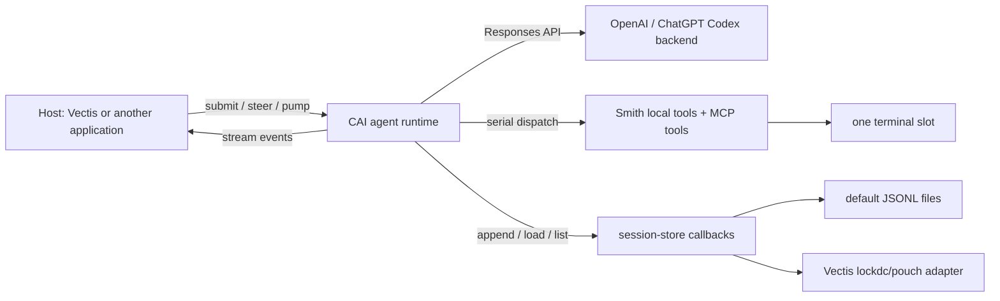
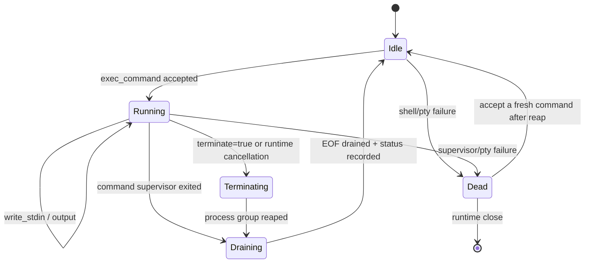

# CAI Agent Mode and the Smith Preset

**Status:** implementation specification with delivery-status notes

**Branch:** `feat/agent-smith`

**Scope:** CAI agent-mode foundation and the first `smith` preset. This is a
design and delivery specification, not an implementation change. “MUST”,
“SHOULD”, and “MAY” are normative.

The first implementation is intentionally smaller than the full target design
in this document. The delivered surface is the owner-thread runtime, local or
callback-backed checkpoints, steering, goals, Smith and Smith-review presets,
the local file/patch/image tools, one managed terminal slot, live-runtime
streaming handover export, and C/Lua reference renderers. Sections explicitly
labelled **Target** describe the next compatible increments; they are not claims
about the released ABI.

## 1. Product decision

CAI becomes the owner of an embeddable, client-side coding-agent loop. The
first preset is named **Smith**, exposed as `smith` and referred to in prose as
“Agent Smith” or simply “Smith”. Smith gives OpenAI coding models a Codex-like
prompt and tool contract while retaining CAI’s C89/POSIX embedding model.

The default visible identity is **Cai Smith**. An embedding product may replace
the identity, for example with **Vectis Agent Smith**, without forking the
prompt or agent runtime. Vectis owns its TUI, Markdown rendering, input widget,
service lifecycle, lockdc/pouch adapters, and product configuration. CAI owns
the model loop, tool contracts, terminal lifecycle, steering queue, session
semantics, compaction, and the default local session backend.

Smith is a preset, not the name of CAI’s generic agent runtime. Future presets
may select different prompts, tool exposure, policies, and model defaults over
the same runtime.

This first delivery deliberately does **not** implement Codex-style
multi-agent/worktree coordination or a `wait_agent` tool. Remote capabilities
belong behind MCP or host-registered CAI tools. The only asynchronous execution
surface in Smith is its single managed terminal.

## 2. Evidence and upstream reference

The design is based on the Codex CLI checkout inspected on 2026-08-17 and on
the project-provided “CAI Agent And Vectis Integration” design note.

Important upstream observations:

- `codex-rs/core/src/tools/handlers/unified_exec/exec_command.rs` and
  `write_stdin.rs` define the model-visible `exec_command` and `write_stdin`
  contract. Codex assigns an execution identifier when the initial bounded
  read yields and requires that identifier for later terminal input/polls.
- `codex-rs/core/src/unified_exec/process.rs` and `process_manager.rs` protect
  each process with an interaction lock, separately track output closure and
  process exit, and only remove the process when its terminal result is final.
  Codex supports multiple process IDs. Smith must not copy that topology.
- `codex-rs/ext/goal/src/tool.rs`, `runtime.rs`, and `steering.rs` define
  `/goal`: persistent state, explicit create/get/update tools, accounting, and
  internal steering items. The visible tool semantics are useful; Codex’s
  thread database and continuation scheduler are not required by Smith.
- `codex-rs/core/src/session/turn.rs` compacts before sampling when context
  limits are reached and also when a model’s *compaction compatibility hash*
  changes. It does not compact merely because a model slug changes. A downshift
  to a smaller context window can also force compaction.
- `codex-rs/core/src/tasks/review.rs` runs review with a separate review
  rubric, no multi-agent collaboration, non-interactive permissions, and a
  model override when configured. `codex-rs/prompts/templates/review/rubric.md`
  is the current rubric source.
- The checked-out public source includes current base instructions in
  `codex-rs/protocol/src/prompts/base_instructions/default.md` and a
  GPT-5.2 Codex model-instruction template in
  `codex-rs/core/templates/model_instructions/`. It does **not** contain a
  checked-in GPT-5.6 Smith-ready instruction asset. Some current model
  instructions are model/backend metadata rather than a stable source file.

Therefore CAI MUST not claim a byte-for-byte GPT-5.6 prompt clone based only
on this checkout. Instead, Smith will maintain versioned CAI prompt assets with
explicit upstream provenance, import upstream prompt revisions deliberately,
and test the resulting rendered request contract against the selected models.
This is both more honest and safer than silently freezing an accidental old
prompt.

## 3. Goals and non-goals

### 3.1 Goals

1. Provide a host-neutral C API for driving an agent session one event at a
   time or through a blocking convenience wrapper.
2. Provide the `smith` preset with Codex-inspired instructions, stable
   tool names, serial tool dispatch, and defaults for
   `gpt-5.6-terra` at medium reasoning effort. Smith permits eight serial
   local tool rounds per submitted model turn, matching the former Smith
   runner and leaving room for read/patch/read-back/terminal workflows.
3. Let an application stream model deltas to any renderer without CAI knowing
   about libmdf, a TUI, or a UI toolkit.
4. Queue user steering safely while a model response or tool loop is active,
   then inject it at the next safe model-request boundary after the next tool
   completion.
5. Supply a **single** durable terminal slot. It must never report a command
   complete until its process supervisor has observed completion, and it must
   never run a second command concurrently.
6. Persist portable, local-first session state with callback replacement for
   lockdc/pouch, remote stores, or another application database.
7. Keep session history client-side and compact it client-side. A resumed
   session must not depend on a server-side previous response ID.

### 3.2 Non-goals for the first Smith delivery

- A CAI TUI, Markdown renderer, line editor, or dependency on libmdf/softline.
- Codex Desktop plugins, browser automation, worktrees, collaboration agents,
  or `wait_agent`.
- Recreating Codex’s sandbox/approval service. Smith exposes policy callbacks;
  the embedding application supplies enforcement.
- A generic shell daemon that promises to retain arbitrary interactive shell
  state across process crash or session resume.
- Background tasks that outlive the single terminal supervisor. Programs that
  deliberately daemonize or escape their process group are outside terminal
  tracking and MUST be reported as such rather than claimed as tracked jobs.

## 4. Architecture



The runtime has exactly one owner thread. CAI may perform blocking model I/O
and tool orchestration on an internal worker, but it never invokes a host UI,
libmdf, softline, Lua, or renderer callback there. Instead it queues immutable
runtime events; the owner thread receives them only through `pump`. A pollable
wakeup descriptor becomes readable whenever such an event is queued, allowing
a host to integrate CAI directly into a softline/libmdf event loop without
timer polling.

CAI MAY use an internal reader thread only for a blocking POSIX terminal or
network transport. Such a thread may append bytes to CAI-owned bounded buffers
and signal a wakeup fd; it MUST NOT call an application callback. The portable
baseline uses host-driven nonblocking/pollable I/O where available.

The runtime serializes all model requests and all tool invocations. Smith sets
`disable_parallel_tool_calls = 1`; receiving multiple function calls in one
model response is a protocol error unless a future preset explicitly provides
a deterministic serialisation policy.

## 5. Public API shape

Existing `cai_agent`, `cai_session`, `cai_stream_sinks`, local tool registry,
MCP client, history export/import, and `cai_session_compact_experimental`
remain supported. Smith is additive. New public declarations belong in
`include/cai/agent_runtime.h`; common opaque declarations may be re-exported
from `include/cai/cai.h` only when that reduces include friction.

The delivered API is declared in `include/cai/agent_runtime.h`. It includes
the one-slot terminal configuration and lifecycle facts, semantic local-tool
outcomes, and the `smith` and `smith-review` presets. Exact field ordering is
ABI and must evolve only through CAI’s normal ABI-version process; this section
summarises the contract rather than duplicating the header verbatim.

```c
typedef struct cai_agent_runtime cai_agent_runtime;
typedef struct cai_agent_session_store cai_agent_session_store;

typedef enum cai_agent_run_state {
  CAI_AGENT_IDLE,
  CAI_AGENT_SAMPLING,
  CAI_AGENT_DISPATCHING_TOOL,
  CAI_AGENT_COMPLETED,
  CAI_AGENT_FAILED,
  CAI_AGENT_CANCELLED
} cai_agent_run_state;

typedef struct cai_agent_runtime_config {
  const char *preset;              /* NULL/"smith"/"smith-review" */
  const char *workspace_directory; /* required canonical workspace root */
  const char *agent_identity;      /* default: "Cai Smith" */
  const char *model;               /* Smith default: gpt-5.6-terra */
  const char *reasoning_effort;    /* Smith default: medium */
  const char *developer_instructions_extension;
  cai_mcp_client *const *mcp_clients;
  size_t mcp_client_count;
  const cai_mcp_tool_registration_config *mcp_tool_config;
  int enable_image_generation;
  const cai_agent_session_store *session_store; /* NULL selects local JSONL */
  const char *session_scope;       /* NULL selects canonical workspace path */
  const char *session_id;          /* NULL generates a new identifier */
  int resume_latest;               /* nonzero: select latest matching session */
  int disable_default_session_store;
  size_t event_queue_limit;
  size_t steering_queue_limit;
  cai_agent_runtime_event_fn event_callback;
  void *event_context;
  size_t turn_queue_limit;
} cai_agent_runtime_config;

void cai_agent_runtime_config_init(cai_agent_runtime_config *config);
int cai_agent_runtime_open(cai_client *client,
                           const cai_agent_runtime_config *config,
                           cai_agent_runtime **out, cai_error *error);
int cai_agent_runtime_submit(cai_agent_runtime *runtime, const char *text,
                             cai_error *error);
int cai_agent_runtime_submit_steering(cai_agent_runtime *runtime,
                                      const char *text, cai_error *error);
int cai_agent_runtime_submit_queued(cai_agent_runtime *runtime,
                                    const char *text, cai_error *error);
int cai_agent_runtime_pump(cai_agent_runtime *runtime, long timeout_ms,
                           cai_error *error);
int cai_agent_runtime_wakeup_fd(const cai_agent_runtime *runtime,
                                int *out_fd, cai_error *error);
int cai_agent_runtime_state(cai_agent_runtime *runtime,
                            cai_agent_run_state *out, cai_error *error);
int cai_agent_runtime_export_markdown(cai_agent_runtime *runtime,
                                      cai_sink *sink, cai_error *error);
int cai_agent_runtime_export_markdown_file(cai_agent_runtime *runtime,
                                           const char *app_name,
                                           const char *path, char *out_path,
                                           size_t out_path_capacity,
                                           cai_error *error);
void cai_agent_runtime_close(cai_agent_runtime *runtime);
```

`submit` is permitted only in `IDLE`, `COMPLETED`, or a terminal error state
after that state has been observed, and only when no queued normal turn is
already waiting. `submit_steering` is permitted during an active sampling or
tool-dispatch state and is bounded, durable, FIFO, and
non-blocking with respect to network/model progress. `submit_queued` is the
separate normal-turn receiver: it queues a durable FIFO user turn that begins
only after the active turn becomes terminal (or begins immediately from an
idle runtime). Both receivers have `_threadsafe` variants. They copy only the
input under a short mutex, append durable journal events, signal the wakeup
descriptor, and never call the host event callback.

`export_markdown` is the live-runtime-only handover projection receiver. It
writes incrementally to the caller's `cai_sink`; it neither reopens a session
from a store nor materializes the complete history or Markdown as an
intermediate buffer. It is owner-thread-only and requires a stable runtime
boundary with no model/tool operation or queued host input. During export CAI
holds the runtime lock while it writes to the sink, therefore a sink callback
must not call back into that runtime. `export_markdown_file` is the small local
convenience layer: it creates a file mode `0600` with `O_EXCL`, never replaces
an existing file, and streams to it. With no explicit path, it creates
`<workspace>/<app_name>-session-<xid>.md`; the default rejects a session ID
that cannot safely form that filename. Callers can pass an explicit path
or use the sink receiver for clipboard, file-picker, or remote destinations.

`pump` advances one or more currently-ready operations until the timeout or a
state boundary. It returns `CAI_OK` for “no event before timeout”; callers
inspect state and events. The convenience `run`/`stream_auto` wrappers are
implemented as a pump loop and retain their present synchronous behavior.

### 5.1 Events

Events are explicit objects delivered through a registration callback and a
bounded queue. The delivered set includes `RUN_STARTED`, `RUN_STATE_CHANGED`,
`RUN_COMPLETED`, `RUN_FAILED`, `TEXT_DELTA`, `TOOL_CALL_STARTED`,
`TOOL_CALL_COMPLETED`, `TOOL_CALL_FAILED`, `STEERING_QUEUED`, `TURN_QUEUED`,
`STEERING_DELIVERED`, `SESSION_CHECKPOINTED`, and the terminal lifecycle
events `TERMINAL_COMMAND_STARTED`, `TERMINAL_OUTPUT`, `TERMINAL_WAITING`,
`TERMINAL_COMMAND_COMPLETED`, and `TERMINAL_COMMAND_CANCELLED`. Each carries
a monotonic sequence and state snapshot; text data is bytes plus an explicit
length, not a NUL-terminated string. Final terminal events carry the observed
exit/signal status, duration, total observed bytes, output truncation, and the
truthful `detached_processes_possible` flag.

CAI retains event storage only until the callback returns or the consumer
releases the event. A host feeding libmdf copies the text in its callback and
does its rendering on its own chosen thread.

### 5.2 Generic agent-mode presentation boundary

This is CAI agent-mode infrastructure, not Smith-specific UI behavior. Every
agent-mode preset uses the same event and presentation contract; Smith is the
first preset to require the terminal extensions below. Presets select prompt,
tools, and policy, while hosts own all rendering.

Agent-mode events are a UI-ready *fact* stream, never a CAI UI policy. The
runtime does not emit ANSI sequences, choose colors, abbreviate commands,
impose a line-display limit, or print a synthetic transcript. A TUI, GUI, log
adapter, or test recorder consumes the same events and makes those choices
locally. This keeps terminal/safety correctness independent from a particular
renderer while making a good renderer straightforward to write.

The generic terminal-manager contract provides `TERMINAL_COMMAND_STARTED`,
`TERMINAL_OUTPUT`, `TERMINAL_WAITING`, `TERMINAL_COMMAND_COMPLETED`, and
`TERMINAL_COMMAND_CANCELLED`. A non-zero exit is a completed command with its
observed status, not a synthetic terminal failure event. Every terminal
event carries the stable runtime terminal ID, command ID, originating tool-call
ID, state transition, and monotonic sequence. Start events carry the submitted
command and resolved working directory; output events carry exact byte spans
and an explicit length; final events carry exit/termination status, duration,
and total captured/omitted byte counts. `TERMINAL_WAITING` is emitted at most
once for one model `write_stdin`/poll operation when that operation produces no
new terminal output. It is not a periodic heartbeat.

Generic tool lifecycle events carry stable tool-call IDs, tool names, a stable
`CAI_AGENT_TOOL_ACTION_*` classification, an optional best-effort primary
target, and a confirmed target count for completed patches. CAI derives these
facts from validated local-tool arguments and the native `apply_patch` result;
hosts do not need to parse model-visible output to render `Read <path>` or
`Patched <path>`. Arbitrary tool/MCP output remains opaque bytes and is
classified as `EXTERNAL` unless a future tool contract provides richer facts.

The C and Lua `smith-terminal` examples are compact reference presentations
over this generic contract: render `$ <command>` on start, dim only the first
ten physical output lines across the command's full lifetime, emit one omission
summary when appropriate, show a waiting line only under the rule above, and
report an abbreviated completed command with exit status and duration. Their
display cap affects presentation only: CAI still drains the PTY and preserves
its separate bounded model-visible terminal result. The examples also render
semantic local-tool receipts such as `Read <path>` and `Patched <path>`.
Snapshot tests cover these examples' rendering policy; core runtime tests cover
the underlying facts.

## 6. Smith preset and prompt assets

Smith must expose a named preset descriptor, not force callers to assemble a
fragile group of flags. Its initial defaults are:

| Setting | Smith default |
| --- | --- |
| Model | `gpt-5.6-terra` |
| Reasoning effort | `medium` |
| Continuity | client history |
| Local history | required |
| Parallel tool calls | disabled |
| Workspace scope | canonical absolute start directory |
| Terminal | enabled: one policy-gated managed command at a time |
| Goals | enabled |
| MCP | enabled when configured |
| Image generation | enabled only when backend/capability exists |

The test profile overrides only model to `gpt-5.6-luna` and retains medium
reasoning effort. It must exercise the same tool schemas and prompt asset as
Smith; a separate testing prompt is prohibited.

### 6.1 Prompt ownership and rendering

CAI stores prompt sources under `prompts/smith/`, with a manifest containing:

```json
{
  "schema_version": 1,
  "preset": "smith",
  "upstream": {
    "project": "openai/codex",
    "revision": "<full git SHA>",
    "assets": ["<source path and SHA-256>"]
  },
  "rendered_asset_version": "smith-2",
  "identity_placeholder": "{{agent_identity}}"
}
```

Prompt sources are imported as Apache-2.0-compatible source material with
their provenance and original notices retained. CAI keeps prompt assets
separate from host configuration and never downloads or mutates them at
runtime. Updating an upstream instruction requires a new reviewed manifest,
hashes, rendered-request tests, and a compatibility decision for existing
sessions.

The renderer has exactly one automatic content substitution in imported base
instructions: only approved identity phrases are replaced with
`agent_identity`, defaulting to `Cai Smith`. It MUST NOT blanket-replace the
word “Codex”: product names, tool names, provenance text, or user-supplied
instructions are not identity substitutions. A downstream product changes the
identity through config; it does not edit the prompt asset.

The Smith renderer produces, in order:

1. Smith base/model instructions with identity substitution;
2. selected preset policy fragments (terminal, tools, goal, storage);
3. repository `AGENTS.md` instruction fragments, bounded and ordered from
   workspace root to current directory;
4. host-supplied developer extension fragment, if configured;
5. the user input or internal context fragment.

The runtime records the rendered prompt asset version and SHA-256 in session
metadata. Existing sessions keep their recorded prompt asset by default; an
explicit host migration may select a newer asset and will trigger the normal
compaction compatibility check.

### 6.2 Review

The delivered `smith-review` preset is an **isolated reviewer runtime**, not a
multi-agent service and not a claim that arbitrary terminal commands are
read-only. Hosts select it with `preset = CAI_SMITH_REVIEW_PRESET` (or Lua
`client:new_smith_review_runtime`). It starts with a fresh session identifier,
uses the Codex-derived review rubric, and accepts one explicit review request:

```c
cai_agent_review_request request;
cai_agent_review_request_init(&request);
request.target = CAI_AGENT_REVIEW_UNCOMMITTED;
cai_agent_runtime_submit_review(runtime, &request, &error);
```

The target is one of `UNCOMMITTED` (staged, unstaged, and untracked changes),
`BASE_BRANCH` (the merge diff against a validated ref), `COMMIT` (a validated
hexadecimal commit ID), or `CUSTOM` (host-owned review instructions). CAI does
not parse `/review`; a TUI/GUI maps its command grammar to this API. A review
runtime accepts exactly one `submit_review` request; generic, queued, and
steering inputs are rejected so its local history cannot become a second
review's hidden context. `smith-review` rejects both `session_id` and
`resume_latest`; it generates a fresh ID, never imports or overwrites a
caller-selected session checkpoint, and persists under a reserved namespace
derived from its requested scope. A normal Smith runtime therefore cannot
select a review checkpoint through `resume_latest`; CAI rejects the reserved
`smith-review:` namespace for normal Smith runtimes.

The reviewer registers `read_file`, `list_files`, `exec_command`,
`write_stdin`, and `view_image` for image-capable models. It excludes
`apply_patch`, goal tools, MCP, image generation, and shared terminal state.
Its terminal is the same one-slot managed terminal as Smith and is governed by
the embedding host's configured execution policy, matching Codex review's
inherited sandbox model. A host that needs OS-level read-only execution must
provide that policy/sandbox; CAI must not misrepresent tool omission as a
terminal security boundary.

The completed reviewer emits `CAI_AGENT_EVENT_REVIEW_REPORT` before
`CAI_AGENT_EVENT_RUN_COMPLETED`. Its data is the model's exact final JSON
report under the documented Codex-compatible schema (`findings`, each with a
location/confidence/optional priority, plus an overall correctness verdict,
explanation, and confidence). CAI preserves the streamed bytes and does not
treat Markdown as persistence or invent a lossy finding model; hosts may parse
the JSON into their own UI or review transport. Before emitting the report, CAI
strictly parses the final output against that schema and validates verdicts,
line ranges, absolute paths, priorities, and confidence ranges. The report
buffer is bounded to 256 KiB, and a tool round clears earlier assistant text so
only the final review response is reported. A successful provider response
without a schema-valid final report fails the run rather than producing a
successful review with no handoff report.

## 7. Tool surface

Smith tool definitions must use stable names and schemas derived from the
Codex-style contract. Descriptions are versioned prompt/tool assets and are
tested as request snapshots. Tool results are structured, bounded, and exposed
to the host as events before they are returned to the model.

| Tool | Kind | Smith behavior |
| --- | --- | --- |
| `exec_command` | function | Submit the one active terminal command; yields with its terminal session ID if still running. |
| `write_stdin` | function | Write/poll/terminate the same terminal command; cannot select another terminal. |
| `apply_patch` | freeform | Apply validated add/update/delete/move patch atomically where possible. |
| `read_file` | function | Read a regular file with byte/line bounds, UTF-8-aware text presentation, and explicit binary refusal/reference. |
| `list_files` | function | Enumerate a bounded subtree with deterministic ordering and ignored-path policy. |
| `view_image` | function | Read/validate an image and append it to the next model request as image input. |
| `imagegen` | namespace/function | Generate or edit an image through a configured image backend; save an artifact and return its path/metadata. |
| `get_goal` | function | Read the session’s current goal and accounting. |
| `create_goal` | function | Create an explicit user-requested goal. |
| `update_goal` | function | Mark an eligible goal complete or blocked. |
| MCP tools/resources | dynamic | Register configured remote MCP capabilities as CAI tools with server-qualified names. |

`cai/tools/read.h` already supplies a local reading basis. CAI’s existing local
tool registry and `cai_mcp_client` provide a base for the registry and
Streamable HTTP MCP client. Smith must wrap them in runtime ownership, events,
serial dispatch, and durable session recording rather than duplicate their
protocol implementations.

### 7.1 File tools

All local file tools resolve paths against the session’s canonical workspace
directory. They reject NUL, paths outside the configured policy roots, and
directories where a regular file is required. Symlink policy is explicit:
default Smith resolves the final target and applies the path policy to the
resolved target. Results contain the model-visible resolved absolute path.

`read_file` accepts `path`, optional one-based `line_start`, optional
`line_end`, and `max_bytes`. It must not silently read unlimited files.
Truncation reports original byte size, emitted byte size, and the exact omitted
range. `list_files` accepts `path`, optional glob, depth and result limits;
sorts bytewise by relative path; returns a truncation marker when bounded.

`apply_patch` is a Responses `custom` (freeform) tool, not a JSON function:
the model sends its patch in the raw `custom_tool_call.input` field and CAI
returns plain text through `custom_tool_call_output`. Its description and Lark
grammar are derived from the Codex tool contract, including the instruction not
to wrap the patch in JSON. It supports add, update, delete, and move; validates
all paths and expected update contexts before publishing success; and returns
the Codex-style changed-file summary. On a failure it returns a precise parser,
path-policy, or context-mismatch error and must not claim a partial patch was
applied. Its implementation is CAI-native: it must not invoke a shell or
depend on `diff` or `patch` executables.

`view_image` validates the source is a supported regular image before bytes
enter model context. The function output intentionally has no large base64
payload; CAI attaches the image as a typed input item during the next request
and records a content hash/path/metadata in session history. It honors the
model’s image-input capability and fails clearly when unsupported.

### 7.2 Image generation

Codex’s current image-generation extension uses an image API, supports at most
five edit references, saves artifacts, and emits begin/end lifecycle items.
Smith mirrors those semantics without depending on the Codex extension.

The Smith schema contains `prompt`, optional `referenced_image_paths`, and
optional `num_last_images_to_include`, which are mutually exclusive. At most
five inputs are allowed. CAI validates source images, invokes the configured
image backend, writes the result below a configured artifact root using a
session-and-call-ID-safe path, and returns `artifact_path`, MIME type, byte
size, content hash, and optional output hint. It emits begin/progress/end
events. No base64 image result is retained in JSONL; a content-addressed store
or host artifact callback may replace local artifact storage.

Image generation is hidden if no backend is configured or the active provider
does not grant the capability. CAI’s hosted image-generation response feature
may be used as a backend only if it can satisfy this artifact and event
contract.

### 7.3 MCP

MCP remains the remote/plugin integration mechanism. CAI opens and initializes
configured MCP clients before a session becomes ready, discovers tools,
resources, resource templates, and prompts, and registers tools with stable
server-qualified names such as `mcp.<server>.<tool>`. It must reject collisions
with Smith built-ins and preserve the original server/tool name in metadata.

MCP calls participate in Smith’s one-at-a-time dispatch rule. A progress
notification becomes `TOOL_CALL_PROGRESS`; a bounded final result becomes a
normal function-call output. Existing CAI Streamable HTTP MCP client support is
reused. stdio MCP and plugin installation are out of this initial scope.

## 8. Single-terminal design

### 8.1 Required invariant

Each Smith runtime owns one terminal *slot*. At most one slot exists, at most
one command is active in it, and the runtime never exposes a second terminal
ID. A slot has a stable `terminal_id` for its runtime lifetime and a monotonic
`command_id`; a dead slot may be re-created in place only after all its fds and
the previous process group have been reaped. It is never recreated
concurrently.

The model-visible tool schema retains Codex-familiar fields where useful:

```text
exec_command: cmd, workdir, yield_time_ms, max_output_tokens, tty
write_stdin:  session_id, chars, yield_time_ms, max_output_tokens, terminate
```

`session_id` always equals the single terminal slot ID. Supplying a stale or
different ID fails with a structured “single terminal is <id>; requested <id>”
error. `exec_command` while the terminal command is running fails instead of
queueing or replacing it. The model must use `write_stdin` to poll, send input,
or terminate.

### 8.2 Delivered state machine



The delivered manager launches one supervised `/bin/sh -c` command in a fresh
PTY/process group; it does not maintain a reusable shell daemon. Only the
transition from `Draining` to `Idle` produces a completed command result.
`Running` output does not imply process liveness. CAI observes the supervising
shell with `waitpid`, drains remaining PTY output, and reports the actual
exit/signal result. A process that deliberately detaches can leave the PTY
open; after the shell exits CAI returns a bounded result with
`detached_processes_possible: true` rather than claiming all descendants
completed.

### 8.3 Delivered execution protocol

The terminal manager uses `openpty`, starts one `/bin/sh -c` command in a
dedicated process group, and owns all PTY I/O. The model cannot choose a shell,
terminal count, or process identity. Output is streamed to host lifecycle
events and a bounded tool result while the manager independently waits for the
supervised shell.

The terminal manager tracks the command process group and reaps the supervised
shell with `waitpid`, not prompt detection or an arbitrary timeout.
`terminate=true` sends
SIGINT to the foreground command group, waits a bounded grace period, then
sends SIGTERM and SIGKILL only as necessary; it reports which signal achieved
termination. Terminal cancellation follows the same sequence. After every
terminal completion, CAI drains output to EOF before giving the model the final
tool result.

Commands that explicitly daemonize, call `setsid`, or otherwise escape the
tracked process group cannot be honestly monitored by a terminal. Smith reports
`detached_processes_possible: true` and never presents those processes as an
active or successfully awaited terminal command. This is the only portable
boundary; it is preferable to the false “running”/“complete” states that this
design is intended to avoid.

Terminal output has a byte limit. CAI streams available bytes to bounded host
events and returns a bounded model-visible result with explicit truncation
facts. It never blocks PTY draining on renderer speed. Interactive input is
accepted only while `Running`; writing after final collection returns a
stale/finished result rather than silently opening a new shell command.

The stream-to-host and model-visible-result limits are execution limits, not
presentation limits. A host may display a smaller head (for example, ten
lines) without changing terminal draining, event delivery, command completion,
or the bounded result delivered to the model.

**Target:** a persistent-shell/nonce-wrapper design may be added only if it
preserves the same one-slot API and comes with adversarial PTY/parser tests.
It is not required for the current simple manager and must not replace
supervised completion with marker or prompt heuristics.

### 8.4 Security and policy

The terminal is capability-gated. Before spawn, CAI calls a host policy callback
with command text, workspace, requested working directory, TTY flag, and
requested policy profile. The host returns allow, deny, or requires-host-
approval. CAI does not implement an OS sandbox in the first slice, but its
interfaces reserve a policy profile and must make a denial model-visible.

No model-provided shell executable, environment mutation, path root, or
terminal count is accepted in Smith v1. The delivered terminal constructs a
fixed minimal environment: `HOME` is the scoped workspace and CAI supplies
only `PATH`, `LANG`, `LC_ALL`, `TERM`, and `TMPDIR`; it never inherits host
variables or credentials. The terminal stops on runtime close; it cannot
continue as a hidden detached CAI thread.

## 9. Agent turn, tool loop, and steering

### 9.1 Turn lifecycle

One submitted user message creates one logical turn. The runtime:

1. checkpoints the input and start state;
2. determines whether compaction is required;
3. renders instructions, context, history, tools, and queued internal inputs;
4. streams a model response;
5. persists raw model output and emits deltas;
6. serially validates and executes at most one model tool call;
7. checkpoints tool start, progress, and final output;
8. creates the next request with tool result plus any eligible steering;
9. completes when the model returns no tool call or fails/cancels definitively.

No agent callback is invoked while the session-store append lock is held. Tool
outputs must be fully committed before their model continuation request begins.
This makes a crash/resume state unambiguous: an unfinished tool call is marked
interrupted and is never replayed automatically unless the tool declares an
idempotency key and the host explicitly elects recovery.

### 9.2 Steering semantics

The default submission mode for an active Smith turn is
`CAI_STEERING_AFTER_NEXT_TOOL_CALL`. It is deliberately implemented in CAI,
not Vectis:

1. CAI immediately validates, assigns an event ID/sequence, persists
   `steering_queued`, emits `STEERING_QUEUED`, and wakes the runtime.
2. Its barrier is the next tool-call completion after its enqueue sequence.
   Success, model-visible tool failure, cancellation, and terminal termination
   all count as a completion boundary.
3. Because Smith serializes calls, when that boundary is reached CAI appends
   the steering input after the tool output and before the next model request.
   CAI checkpoints the completed tool/response state first, then emits
   `STEERING_DELIVERED`; a subsequent checkpoint advances its durable watermark
   only after that injected input is part of session state.
4. If the active response finishes without another tool call, CAI delivers the
   steering as the next user input immediately after that logical turn reaches
   a safe completion boundary. It cannot disappear behind an absent tool call.
5. Multiple steering inputs preserve FIFO order and share the earliest eligible
   boundary. A cancelled runtime preserves queued inputs; they are delivered
   on resume only if the host resumes that session. A crashed request cannot
   continue in place, so restored steering is scheduled ahead of restored
   normal turns, while preserving FIFO order within each class.

Steering requires an active turn; hosts start an idle turn with `submit`.
Normal future work belongs on `submit_queued`, which persists `turn_queued`,
emits `TURN_QUEUED`, and is consumed FIFO only after the current turn reaches
`COMPLETED`, `FAILED`, or `CANCELLED`. Its accepted event remains pending across
checkpoints until the runtime records that particular input as incorporated.
If a budgeted goal becomes exhausted before a queued turn can start, CAI emits
an explicit terminal rejection and checkpoints that rejection rather than
silently consuming the turn. A host may expose these two API paths however it
chooses, but must not fake either by injecting text directly into the renderer
or transport.

### 9.3 Concurrency with Vectis/libmdf/softline

Vectis runs libmdf and softline in its UI/event-loop domain. It registers CAI
event delivery on that same owner thread and calls `pump` without holding any
libmdf or softline lock. If it uses an agent worker, it copies CAI events into
a mailbox and renders them on the UI thread. A UI keypress selects either the
thread-safe steering or queued-turn enqueue operation; CAI writes its wakeup
fd, and the runtime owner integrates that fd into its poll loop. Neither CAI
nor Vectis is allowed to enter a `lua_State` or a libmdf renderer from a terminal/network
worker thread.

## 10. Goals

Goals are per-session durable state. Smith adopts Codex’s constrained public
contract:

- `get_goal` returns current status, objective, optional token budget, elapsed
  time, token use, remaining budget, and progress accounting;
- `create_goal` requires an explicit user/system/developer request and fails
  while a non-terminal goal exists;
- `update_goal` accepts only `complete` or `blocked` from the model;
- `clear_goal` is Smith's idempotent equivalent of Codex's `/goal clear`:
  it removes the current goal without asserting completion, so a subsequent
  `create_goal` starts fresh;
- `blocked` is allowed only after the same external blocking condition has
  occurred across three consecutive goal turns; hard work, uncertainty, or a
  desire for clarification is not enough;
- a budgeted completed goal reports its final usage.

Goal statuses are `active`, `complete`, `blocked`, `usage_limited`, and
`budget_limited`. Only `active` is model-settable at creation and only
`complete`/`blocked` at update. Host policy controls pause/resume/usage limits.
CAI records at most one blocked assessment for each distinct user-turn
boundary. A repeated `update_goal({"status":"blocked"})` in the same turn is
rejected without advancing the count; an intervening active-goal turn that
does not qualify as blocked resets it. The tool contract and developer prompt
remain responsible for the semantic requirement that the external blocker is
the same one on all three turns.
The runtime records one goal-accounting checkpoint at each model response and
tool round. When a budgeted active goal reaches its token budget, the runtime
atomically records `budget_limited`, checkpoints that terminal state, and
prevents the next model request. It does **not** auto-continue indefinitely:
after a completed model turn, a host must call `pump`/submit according to the
normal runtime policy.
The first delivery can emit a continuation context item only when an explicit
host setting enables goal continuation.

Goal context injection mirrors Codex conceptually: short internal user-context
fragments are appended for objective updates, continuation, and limits. They
are session records and model input, but are marked internal so normal
transcript renderers do not display them as user prose.

## 11. Session storage and resume

### 11.1 Store contract

`cai_agent_session_store` is an append-oriented callback interface. CAI owns
the durable-state schema, passes checkpoints through `cai_source`, and
represents journal updates as structured `cai_agent_session_event` values; a
backend does not need CAI’s allocator or filesystem. Its callback table
contains the backend context and has four required operations:

- `checkpoint(context, scope, session_id, state_source,
  applied_event_sequence)`, which synchronously consumes a complete runtime
  snapshot;
- `load_latest(context, scope, session_id_out, state_source_out,
  applied_event_sequence_out)`, which returns the newest snapshot or a
  successful `NULL` source when none exists;
- `append_event(context, scope, session_id, event)`, which durably records one
  ordered journal event; and
- `load_events_after(context, scope, session_id, sequence, callback)`, which
  replays subsequent events in strict order.

Snapshots and events are opaque UTF-8 JSON payloads defined by CAI. A
checkpoint source is owned by CAI and must be consumed synchronously without
being retained or closed. A source returned by `load_latest` is newly allocated
for CAI to consume and close. The store must make a successful event append
visible before it returns, preserve event order, and never expose a torn
checkpoint. CAI assumes one active writer per session; remote locking, leases,
or CAS remain backend policy.

### 11.2 Default local backend

The local store root is `${XDG_STATE_HOME:-$HOME/.local/state}/cai/agent`.
Each session is one append-only JSONL file under
`sessions/<scope-sha256>/<session-xid>.jsonl`. Generated session IDs are
canonical [XID](https://github.com/rs/xid)-compatible 20-character,
lowercase-base32 values (`[0-9a-v]{20}`): a sortable timestamp, machine
component, process ID, and randomized-start counter. They are opaque storage
keys, not authorization secrets. The header record is
`session_created`; its metadata stores the canonical absolute workspace path,
human scope, opaque scope key, preset, model/profile, rendered prompt manifest
version/hash, creation time, and format version. The hash is a file-layout
component, not the selection key; exact absolute path remains the default scope
filter.

Writes use a same-directory temporary append/snapshot protocol, fsync the file
before acknowledging a record, and maintain a compact snapshot record in the
same JSONL stream. Startup scans the final line defensively, ignores only an
incomplete trailing line caused by a crash, and refuses malformed committed
records. No global database or separate index is required for correctness.

Opening Smith without an explicit session ID lists sessions whose stored
canonical absolute path equals the runtime workspace path and resumes the most
recent resumable one when `resume_latest` is set. It never silently crosses
workspace directories. A host may provide `session_scope` for a deliberate
shared namespace; that exact supplied opaque key then replaces directory
matching. The local JSONL store hashes every non-empty key without interpreting
it as a filesystem path. If checkpoint mtimes tie, it chooses the
lexicographically later session ID; generated XIDs preserve chronological order
under that deterministic fallback.

### 11.3 Format

Every JSONL record has at least:

```json
{
  "format_version": 1,
  "session_id": "9m4e2mr0ui3e8a215n4g",
  "sequence": 42,
  "time": "2026-08-17T12:34:56.123Z",
  "type": "tool_completed",
  "payload": {}
}
```

Record types include `session_created`, `turn_started`, `input_added`,
`model_request`, `model_response`, `tool_started`, `tool_progress`,
`tool_completed`, `tool_failed`, `terminal_state`, `steering_queued`,
`turn_queued`, `input_journal_v2`, `input_consumed`, `steering_delivered`,
`goal_changed`,
`compaction_started`,
`compaction_completed`, `checkpoint`, `turn_completed`, and `turn_failed`.
Large binary/image/tool artifacts are external references with hash, MIME,
byte size, and storage URI/path; JSONL does not contain arbitrary large base64
blobs.

The canonical state reconstructs model-visible history exactly, including
function calls and outputs, internal context inputs, model/preset information,
and goal state. The durable input journal reconstructs pending steering and
normal turns. It also stores a display transcript projection so hosts can resume
UI history without re-parsing provider wire events.

### 11.3.1 Journal/checkpoint atomicity

Steering and queued normal turns are accepted from a non-owner thread while the
worker may be streaming, so acceptance cannot read or snapshot mutable session
state. The storage ABI therefore has two coordinated operations: an append-only
input event write and a checkpoint write with an `applied_event_sequence`
high-watermark. A successful `steering_queued` or `turn_queued` append is
fsync-visible before CAI reports acceptance to the caller. At a safe boundary,
the owner thread injects an input, appends an `input_consumed` marker naming the
input event, then writes a replacement checkpoint whose watermark covers that
marker. The checkpoint therefore preserves completed tool history even when an
earlier normal turn is still pending.

When a durable store opens a new session, CAI first writes an empty checkpoint
with watermark zero. This silent anchor lets a default latest-session lookup
find an acknowledged first `turn_queued` event even if the process stops before
the worker reaches its first normal checkpoint.

On resume CAI imports the latest checkpoint and replays the complete input
journal to reconstruct only still-pending inputs. An `input_consumed` marker is
authoritative only when its own sequence is at or below the checkpoint
watermark; it then suppresses the named input because that checkpoint contains
it. A marker after the watermark may have been written immediately before a
crash, so CAI deliberately ignores it and replays its input. Thus a crash never
loses accepted input, while completed non-idempotent tool results are never
discarded merely because a later steering input and an earlier queued normal
turn interleave. `STEERING_DELIVERED` remains observational only. A callback
backend must provide this append-before-checkpoint ordering contract.
On its first resume of a pre-v2 journal, CAI appends `input_journal_v2`;
records before that boundary retain the former watermark-only replay rule, so
upgrading does not replay steering already represented by an older checkpoint.

### 11.4 Vectis adapter

Vectis implements the store callbacks using liblockdc and pouch. Default Vectis
configuration targets local pouch under Vectis’s XDG state root; a configured
remote lockd endpoint is equivalent from CAI’s perspective. The adapter owns
authentication, endpoint selection, locks/leases, and backend-native search.
CAI neither links liblockdc/pouch nor makes a network client part of its core
library.

### 11.4.1 Lua-native backend handles

A C host embedding CAI through Lua can expose the same callback backends
without reimplementing them in Lua. `cai.native_store(kind, callbacks,
context)` accepts C lightuserdata and returns a typed Lua handle. The common
constructor supports `"agent_session"` for a complete
`cai_agent_session_store` pointer, `"mcp_session"` for a
`cai_mcp_session_callbacks` pointer plus context, and `"todo"` for a
`cai_todo_store_callbacks` pointer plus context. The callback table is copied;
CAI never frees the opaque context directly.

Attach these handles only at their matching surface: `session_store` on a Smith
runtime, `session` on an MCP handler, or `store` on the todo tool. Todo and MCP
handles transfer to their core owner and run their native destruction callback
exactly once. An agent-session handle is pinned until its runtime closes; its
native context must remain live for that period. The adapter never calls into
`lua_State`, so stores remain usable from the runtime worker thread. Lua-level
MCP callbacks remain supported independently for applications that deliberately
implement the backend in Lua.

### 11.5 User-initiated transcript export

CAI provides a live-runtime transcript projection comparable to Codex CLI's
current `/export`. The upstream behavior was inspected on 2026-08-19 at Codex commit
`f5a3dc55404ddc066a4e4a65602fee166ecc46b3`:

- `/export` is a TUI/user command, rather than a model tool. It hydrates the
  complete persisted conversation (falling back to visible cells only for an
  ephemeral thread), renders Markdown, then copies it to the clipboard or
  creates a new file without overwriting an existing one.
- The Markdown begins `# Codex conversation` and uses `## User`,
  `## Assistant`, `## Plan`, `## Reasoning`, and `## Activity` sections.
  Message Markdown is retained; activity is indented; terminal-control text is
  sanitized; image/audio data become placeholders; and export/copy notices,
  hidden review prompts, and nested review duplicates are excluded.

CAI deliberately has no `/export` parser and does not register export as a
model tool. Hosts call `cai_agent_runtime_export_markdown` to stream the
already-resumed live runtime's durable history to a caller-owned `cai_sink`.
The C and Lua Smith examples implement their own `/export` interception by
calling the default-file helper with app name `cai`, which writes
`cai-session-<xid>.md` in the canonical workspace. A downstream TUI can bind
the same receiver to a menu, a file picker, or a clipboard sink without CAI
depending on libmdf, softline, or a desktop clipboard implementation.

The handover contract is `cai-agent-handover/1`, headed `# CAI agent handover`.
It is deliberately **not** a serialization or resume format: the durable
session checkpoint remains authoritative for continuation. The document first
records the active preset and prompt version, active model/reasoning effort
(and the recorded history model when it differs), stable session XID, workspace
and session scope, tool capabilities, durable goal status/objective/accounting,
and the complete active developer instructions.
It then renders `## User`, `## Assistant`, `## Developer`, `## System`,
`## Reasoning`, and `## Activity` as represented in durable Responses history.

User, assistant, and developer Markdown is retained after terminal-control-byte
removal. Function arguments and function outputs are indented activity blocks;
non-text image/file/audio content becomes `*[non-text attachment omitted]*`.
The projection never embeds raw binary attachment payloads. It also states its
limits explicitly: no live terminal/PTY state, in-flight model or tool work, or
queued host input appears in the handover. It accepts semantically equivalent
durable JSON regardless of object-member ordering: CAI normalizes durable
history to independently rewindable item records on append/import, then
performs one bounded metadata scan and one render pass per record. Export is
linear in history size, writes through bounded parser and transport buffers,
and never materializes a complete handover. This live-only API does not load a
separate session by ID: a host resumes the desired session into a runtime before
exporting it.

The handover is intentionally transparent about privacy: text tool outputs,
MCP outputs, and developer instructions are included because they are useful
agent context. CAI does not automatically redact that text; embeddings needing
redaction or different retention use the sink receiver to transform or gate the
destination, or store redacted data. Future format versions may add explicit
plan, artifact, and review-child projections once those durable forms are
defined.

Whether CAI also exposes an optional `export_conversation` local tool remains
an open design decision. Smith MUST NOT register it by default: export is a
user/host operation, while a model-visible tool could disclose private
transcript content or trigger an unwanted filesystem/clipboard side effect.
If a host later opts in, it must supply the destination and authorization
policy; it cannot rely on the default Smith tool policy.

Verification covers deterministic handover metadata, developer and goal
context, multi-write streaming behavior, function activity, attachment
omission, default XID filenames, no-overwrite, and invalid default app names.
Embedding applications own clipboard, picker, and external-store destination
integration tests.

## 12. Client-side compaction

Smith requires `CAI_SESSION_CONTINUITY_CLIENT_HISTORY` and local history. It
does not rely on `previous_response_id` for resumability. Existing CAI history
capture/export is a base, but Smith records full semantic events so it can
reconstruct the exact client-side request history after process restart.

Before every model request CAI evaluates:

1. configured Smith context budget and model-advertised context window;
2. explicit host/requested compaction;
3. prior/current compaction compatibility metadata; and
4. a model downshift where current retained history cannot fit the new usable
   context window.

The per-model profile includes `context_window_tokens`, optional
`auto_compact_threshold_tokens`, and `compaction_compatibility_hash`. A model
switch with equal hashes does **not** compact solely because its name changed.
A differing non-empty hash does. A switch to a smaller window compacts if
active context would not fit. When either profile lacks compatibility metadata,
Smith uses the conservative policy: compact before continuing across different
model families/major versions, but it may retain history across explicitly
declared compatible variants such as terra/luna. This policy and its reason are
persisted in `compaction_started`.

Compaction is a client-side model call using the current session’s compact
prompt asset. It produces a bounded, structured replacement history containing
task status, decisions, modified files, unresolved risks, tool outcomes, goals,
and pending steering. CAI then atomically appends the compaction result and
replaces only its *active model context*; the original JSONL event history is
never discarded. If summarization fails, CAI preserves the original context,
reports the error, and lets the host decide whether to retry, choose another
model, or start a fresh session. It must never silently truncate arbitrary
history as a substitute for compaction.

The initial compaction implementation may call CAI’s existing
`responses/compact` support when it returns a portable replacement history that
can be persisted and replayed. If that endpoint does not meet the contract for
the selected backend/model, CAI uses a normal Responses summarization call; it
does not make session durability depend on an opaque server session.

## 13. Error handling, cancellation, and limits

All new APIs return existing CAI status values plus `CAI_ERR_CONFLICT` and
`CAI_ERR_STATE` if those do not already exist when implemented. Errors name the
state, session ID, terminal ID/command ID, operation, and safe underlying
diagnostic. Model-visible tool errors are compact actionable strings; host
events retain technical detail.

Cancellation stops model streaming, prevents a new tool from starting, applies
the terminal termination sequence if necessary, persists a checkpoint, and
emits one final cancelled state. It is idempotent. Store failure after external
tool execution is a hard stop: CAI reports an indeterminate durable state and
does not continue the model loop.

Smith reuses existing CAI usage accounting. It configures a session limit and
enforces it before each model/compaction request. Goal accounting is additional
metadata, not a second billing counter. A usage-limited goal ends in
`usage_limited`; a normal session usage-limit error remains `CAI_ERR_LIMIT`.

## 14. Delivery plan

The implementation is intentionally staged; each stage must leave a coherent,
tested public surface.

1. **Runtime core and event loop.** Add owner-thread runtime, event queue,
   pump API, serial tool scheduling, and stream-to-event adapter over existing
   CAI agent/session functions.
2. **Storage and resume.** Add callback store ABI, local JSONL backend,
   directory scope selection, checkpoints, recovery, and session event schema.
3. **Smith prompt/profile.** Add prompt asset manifest/import tooling, identity
   renderer, GPT-5.6 terra/luna profile metadata, request snapshots, and
   `smith` preset construction.
4. **Local coding tools.** Add validated file/list/image/patch tools and the
   one-slot terminal manager. Turn off parallel calls in Smith. Define generic
   terminal and semantic local-tool outcome events, then add matching C and Lua
   `smith-terminal` examples as presentation-only adapters.
5. **Steering and goals.** Add durable queued steering, safe-boundary
   delivery, goal tools/state/accounting, and continuation policy.
6. **MCP/image generation/review.** Adapt current MCP client into runtime
   tools, add image artifact backend contract, then add ephemeral read-only
   review runs.
7. **Vectis integration and live proof.** Implement the external adapter in
   Vectis only after CAI’s callback ABIs are stable. It is not a CAI dependency.

Each stage is a separate coherent commit/PR-sized change. No feature flags or
parallel legacy agent loops are permitted; existing generic CAI APIs remain,
but Smith uses the new runtime as its sole loop.

## 15. Verification matrix

Every implementation stage needs deterministic unit/integration tests and the
project’s standard formatting/test gates. The agent behavior test suite must
use observable model/tool/store behavior rather than private fields.

### 15.1 Deterministic tests

- Prompt renderer snapshots prove provenance hash, identity substitution, no
  accidental Codex-word replacement, profile defaults, and stable tool schema.
- Runtime tests prove only one request/tool runs at a time; a response with two
  function calls is rejected by Smith.
- Terminal PTY tests prove yielded output, final output, EOF-before-final,
  completion after a quiet command, interactive stdin, wrong session ID,
  stale writes, cancellation escalation, shell death, output truncation, and
  no second concurrent command. A test must assert that a command is not
  reported complete until wrapper exit and pty drain are observed.
- Renderer snapshot tests prove the C and Lua Smith terminal examples produce
  the same semantic receipts, one `$` command-start line, at most ten dimmed
  physical output lines per command, a single omission summary, and no
  repeated waiting lines. They must also prove that display truncation does
  not alter the model-visible terminal result.
- Patch tests cover valid add/update/delete/move, invalid grammar, path escape,
  mismatched context, and all-or-nothing failure.
- Session tests cover JSONL recovery after an incomplete trailing write, CAS
  conflict, exact workspace selection, custom scope selection, format upgrade
  rejection, and no cross-directory resume.
- Steering tests cover queue while text streams, next-tool delivery, tool error
  boundary, no-tool fallback delivery, FIFO multiple entries, cancellation,
  and resume before delivery.
- Goal tests cover explicit creation, unfinished-goal rejection, three-turn
  blocked threshold, complete accounting, and invisible internal context.
- Compaction tests cover threshold, same-hash switch no compaction,
  changed-hash compaction, downshift compaction, unknown-profile conservative
  policy, failed compaction preservation, and replay of compacted history.
- MCP tests cover discovery, collision rejection, serial dispatch, progress,
  result bounds, and persisted remote-call records.
- Review tests prove an isolated review request renders the Codex-derived
  rubric and target, exposes the managed terminal but no mutation tools, and
  emits the exact final JSON report event before completion.

### 15.2 Live end-to-end proof

With the user-authorized ChatGPT subscription from `~/.codex/auth.json`, run
the Smith e2e suite against `gpt-5.6-luna` at medium reasoning effort. The
suite uses a disposable fixture repository and a local deterministic MCP test
server. It must prove a coding task that reads files, edits through
`apply_patch`, uses the terminal, receives a steering message during streaming,
resumes from JSONL, and verifies its own result. It must not expose auth tokens
in artifacts/logs and must never run against a user workspace.

`gpt-5.6-terra` medium is the primary Smith configuration and receives a
smaller acceptance smoke after the luna suite. Live tests are opt-in and never
part of an offline default test target.

## 16. Acceptance criteria

Smith is ready for the first implementation release only when all of these are
true:

1. A C host can create Smith, stream/pump it, and render output without a CAI
   UI dependency.
2. The request records a versioned upstream-derived prompt asset and renders
   `Cai Smith` by default or the configured downstream identity.
3. Smith exposes the listed local tools, goal tools, and configured MCP tools
   with serial calls and bounded output.
4. One and only one terminal command can be running; the final result is
   emitted only after verified exit plus output drain; termination is observable
   and stale terminal operations fail safely.
5. A steering message submitted while output is streaming is durable and reaches
   the next eligible model request after a tool completion, with a no-tool
   fallback.
6. Default session resume selects only the same canonical absolute directory;
   session JSONL survives restart and supports a callback replacement backend.
7. Client-side compaction preserves resumability, uses compatibility metadata
   instead of model-name superstition, and retains original durable history.
8. A Smith review request is isolated from the parent session, uses the
   Codex-derived rubric and explicit target, and emits its final JSON handoff
report. It has no CAI file-mutation tools; terminal execution follows the
host's normal sandbox policy.
9. Deterministic tests and the opt-in luna live e2e proof pass.
